# Errors from the MoreOpenWhisperer rework

Branch `moreopenwhispr-ui-refresh`, commit `266f0703`. Findings are grouped by importance. Each folder has an explanation and a proof image. This file does not propose fixes.

## Important

### Assistant with tools never receives the screenshot

Folder: `important/01-assistant-drops-screenshot-when-tools-are-on`

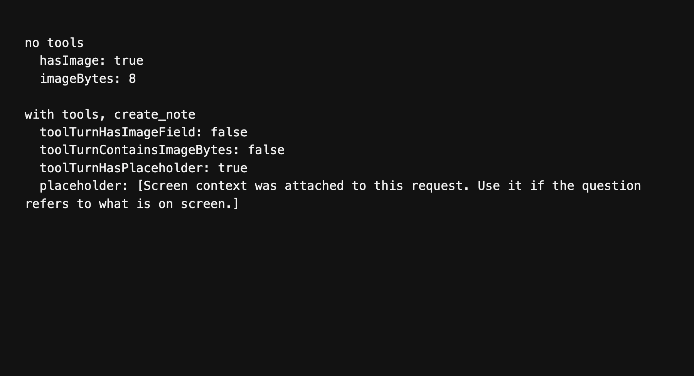

Importance: Important

Share screen context is on, and the voice assistant still answers as if it cannot see the display, whenever the turn is allowed to use tools. Notes, calendar, and the rest of the assistant tools take that path. The screenshot is kept only for a turn that has no tools at all.

`runAntigravityChatStream` in `src/services/ai/antigravityChat.ts` forwards `screenContext` to `processAntigravityReasoning` when `tools` is empty. When `tools` has entries, the image is not included in `processAntigravityToolTurn`. The user message gains this line instead:

`[Screen context was attached to this request. Use it if the question refers to what is on screen.]`

The bytes of the JPEG are not in that request.

## What the run showed

A turn with no tools sent the image. `hasImage` was true and `imageBytes` was 8.

A turn with a `create_note` tool sent no `screenContext` field. The payload did not contain the image bytes `QUJDRA`. It did contain the placeholder sentence above.

### Stopping the assistant still runs the tool

Folder: `important/02-cancel-still-runs-assistant-tools`

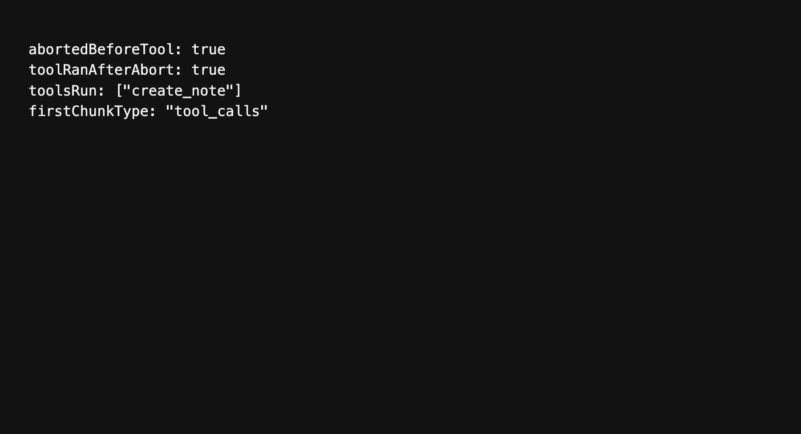

Importance: Important

Esc or Stop aborts the Antigravity chat signal, but the turn that is already in flight still comes back and still runs its tool. A cancelled request can create or change a note after the user has stopped it.

`cancelActiveStream` in `src/services/ReasoningService.ts` calls `abort()` on the controller. `runAntigravityChatStream` in `src/services/ai/antigravityChat.ts` checks that signal only at the top of the loop, before `processAntigravityToolTurn`. The IPC payload has no abort signal. When the response arrives, the function does not look at the signal again. A `tool_call` result goes straight to `executeToolCall`.

## What the run showed

The signal was aborted while the tool turn was still waiting. After the response was released, `executeToolCall` ran `create_note`. `toolRanAfterAbort` was true, and the first chunk type was `tool_calls`.

### Live transcription rejects the recording itself

Folder: `important/03-live-transcription-refuses-the-recording`

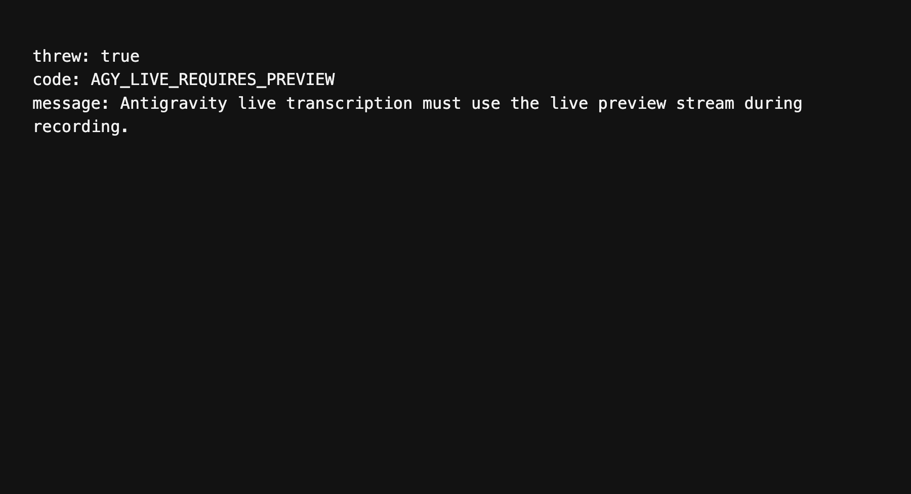

Importance: Important

Gemini 3.5 Transcribe Live is a selectable Antigravity model. If the live preview stream does not hand back a committed transcript, the recording is not transcribed. The batch path throws and stops.

`transcribeWithAntigravity` in `src/helpers/antigravityTranscription.js` hits this before it converts audio or calls the gateway, when the model is `gemini-3.5-transcribe-live`:

`Antigravity live transcription must use the live preview stream during recording.`

The error code is `AGY_LIVE_REQUIRES_PREVIEW`. That throw sits outside the gateway fallback, so the older `agy` write-file path does not run either. `processWithOpenAIAPI` in `src/helpers/audioManager.js` only skips the batch call when the preview stop already returned non-empty streamed text with `streamed: true`. An empty or truncated live flush falls through to this throw.

## What the run showed

`transcribeWithAntigravity` was called with model `gemini-3.5-transcribe-live` and a wav buffer. It threw `AGY_LIVE_REQUIRES_PREVIEW` and the message above. The access-token function was never called.

### Paste focuses the app and switches Spaces

Folder: `important/04-paste-focuses-the-app-and-switches-spaces`

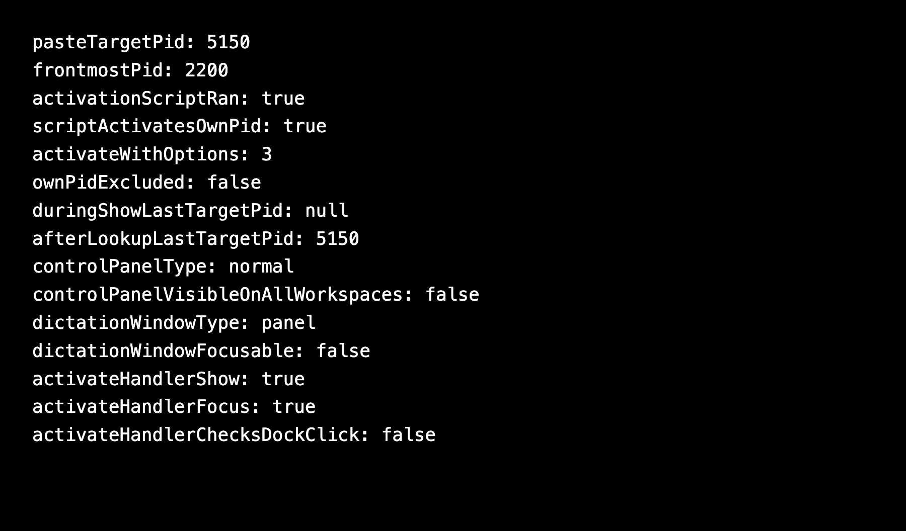

Importance: Important

Dictation paste on macOS activates a process and brings every window of that process forward. When the stored process is this app, that set includes the control panel. The control panel is a normal window, and it does not appear on every Space. macOS switches to the virtual desktop where that window sits. The paste keystroke is then delivered to the app that activation just brought forward.

`paste-text` in `src/helpers/ipcHandlers.js` calls `textEditMonitor.activateTargetPid()` before it pastes. `activatePid` in `src/helpers/textEditMonitor.js` calls `_activateApp`. The script there runs `activateWithOptions(3)`. That value is all windows combined with ignoring other apps. The function does not skip this app's own pid.

The pid is whatever `captureTargetPid` stored. That method clears `lastTargetPid` and starts an osascript lookup. Hotkey handling calls `showDictationPanel` without waiting for the lookup. `_sendDictationToggle` in `src/helpers/windowManager.js` does this, and the macOS hotkey handlers in `main.js` do the same. The value written later is the app that is frontmost when the lookup finishes. Paste then activates that pid.

The dictation pill is a panel, not focusable, and visible on all workspaces. The control panel is not. `CONTROL_PANEL_CONFIG` sets `type` to `normal` and `visibleOnAllWorkspaces` to false.

`app.on("activate")` in `main.js` is a second path to the same window. When any window already exists, the handler calls `controlPanelWindow.show()` and `controlPanelWindow.focus()`. It does not check that the Dock was clicked. Showing and focusing that normal window moves the user to its Space.

## What the run showed

The paste target was pid 5150. Another app, pid 2200, was frontmost. `activateTargetPid` still ran the activation script once. The script matched `processIdentifier === 5150` and called `activateWithOptions(3)`. The activate function does not mention `process.pid` or `getOwnProcessPids`.

A capture was started, and the show-panel step ran while `lastTargetPid` was null. The lookup then stored 5150.

The loaded window config reported the control panel as type `normal` with `visibleOnAllWorkspaces` false, and the dictation window as type `panel`, `focusable` false, `visibleOnAllWorkspaces` true.

The activate handler source contains both `controlPanelWindow.show()` and `controlPanelWindow.focus()`, and it does not read an event or a reason.

## Medium importance

### A missing model is reported as a rate limit

Folder: `medium/01-missing-model-reported-as-rate-limit`

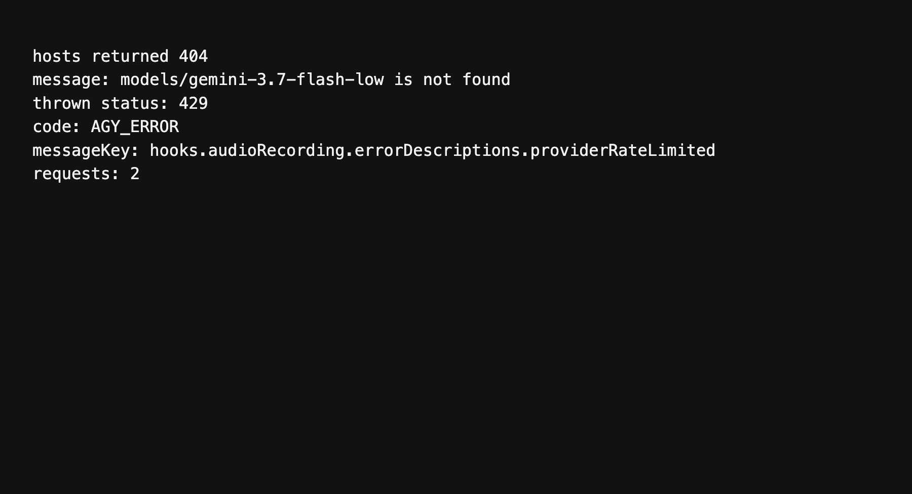

Importance: Medium importance

When both Cloud Code hosts answer 404 for a model, `generateContent` in `src/helpers/antigravityGateway.js` still throws with HTTP status 429. The UI then uses the rate-limit string, `hooks.audioRecording.errorDescriptions.providerRateLimited`, even though the body says the model was not found.

After a 404 or a 429, the inner retry loop breaks and the next host is tried. When the hosts are exhausted, the function calls `throwGatewayFailure(429, lastBody)` regardless of the status that was actually returned.

## What the run showed

Both hosts were asked for `gemini-3.7-flash-low` and both returned 404 with `models/gemini-3.7-flash-low is not found`. The thrown error had `status` 429, `code` `AGY_ERROR`, and `messageKey` `hooks.audioRecording.errorDescriptions.providerRateLimited`. The message text was still the not-found string.

### The transcription model in the picker is not the model that is sent

Folder: `medium/02-selected-transcription-model-is-not-sent`

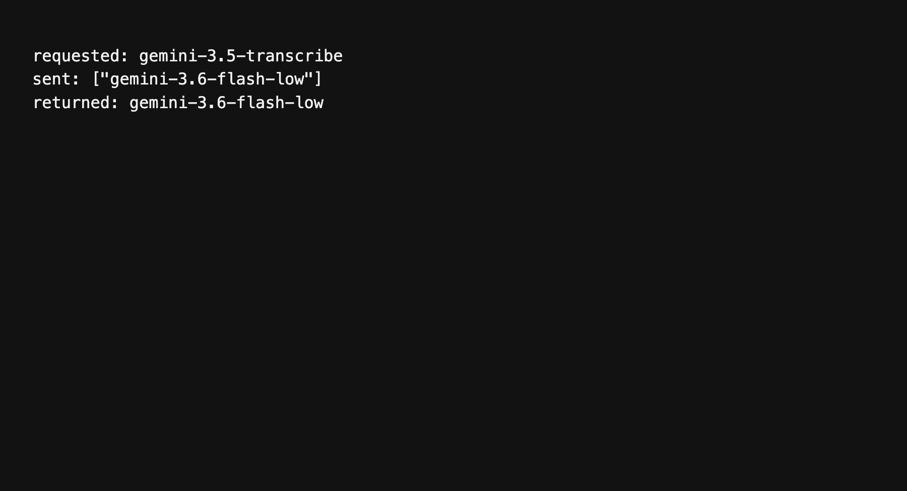

Importance: Medium importance

The Antigravity speech model in the registry is `gemini-3.5-transcribe`, named Gemini 3.5 Transcribe. `transcribeAudioViaGateway` in `src/helpers/antigravityGateway.js` accepts that `model` argument and does not send it. The request loop always uses `GATEWAY_STT_MODELS`, which starts at `gemini-3.6-flash-low`, then `gemini-3-flash`, then `gemini-2.5-flash`.

## What the run showed

The call requested `gemini-3.5-transcribe`. The gateway body contained `gemini-3.6-flash-low`. The returned model was `gemini-3.6-flash-low`.

### Retired Gemini 3.5 Flash rows are still choices

Folder: `medium/03-retired-flash-models-still-in-the-picker`

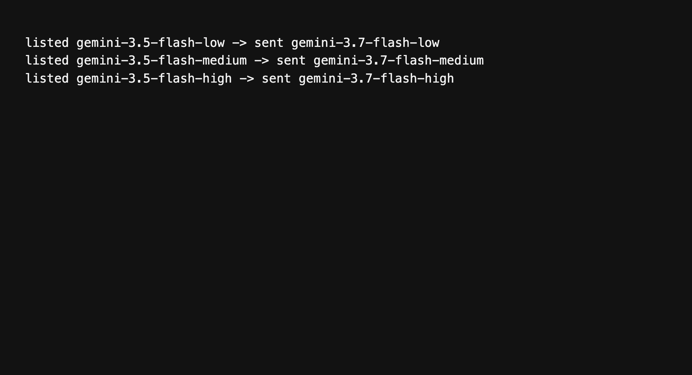

Importance: Medium importance

Settings still lists three Antigravity cleanup models that the CLI mapping immediately replaces:

- `gemini-3.5-flash-low` is sent as `gemini-3.7-flash-low`
- `gemini-3.5-flash-medium` is sent as `gemini-3.7-flash-medium`
- `gemini-3.5-flash-high` is sent as `gemini-3.7-flash-high`

The rows live in `src/models/modelRegistryData.json` under the `antigravity` cloud provider. `resolveAgyCliModel` in `src/helpers/antigravityModels.ts` performs the replacement. The 3.7 rows are listed as well, so the 3.5 rows are a second set of labels for the same three models.

## What the run showed

Each listed 3.5 id was passed through `resolveAgyCliModel`. Each one came back as the matching 3.7 id.

### Antigravity audio conversion has no deadline

Folder: `medium/04-antigravity-audio-convert-can-hang`

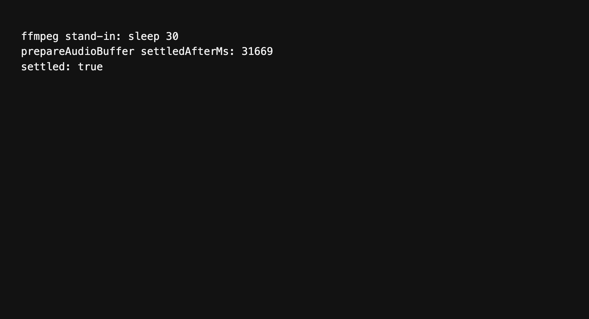

Importance: Medium importance

Dictation that needs a wav conversion calls `convertToWav` in `src/helpers/antigravityTranscription.js`. That function uses `spawnSync` and does not pass a `timeout`. The dictation request stays on that call until ffmpeg exits. A stuck ffmpeg holds the transcription for as long as the process lives.

`prepareAudioBuffer` is the exported caller. It runs the conversion whenever `ffmpegPath` is set and the input is not already wav.

## What the run showed

`prepareAudioBuffer` was pointed at a stand-in binary that only runs `sleep 30`. The call did not return until that sleep finished. `settledAfterMs` was 31669.

### A narrow window says Dictation while Settings is open

Folder: `medium/05-narrow-settings-labeled-as-dictation`

Importance: Medium importance

Below 800px the sidebar is replaced by the compact nav in `ControlPanel.tsx`. Settings is a real view, but it is not one of `CONTROL_PANEL_NAV_ITEMS` in `src/components/control-panel/controlPanelNavModel.ts`. `ControlPanelCompactNav` looks up the active view in that list and, on a miss, uses the first item. The first item is Dictation.

The page underneath is Settings. The menu trigger still reads Dictation.

## What the screenshot shows

The window content size was 720 by 800. Settings was opened from the gear button. The trigger label was `Dictation`. The body of the page was the Settings view, on Preferences.

### A refresh writes the Antigravity token file back after it is gone

Folder: `medium/06-sign-out-undone-by-token-refresh`

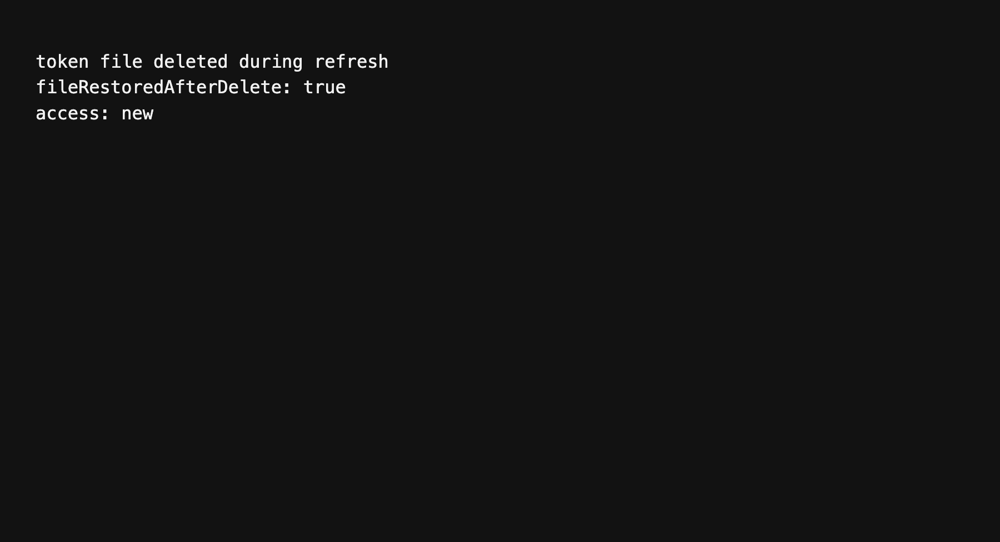

Importance: Medium importance

`getAntigravityAccessToken` in `src/helpers/antigravityAuth.js` reads `~/.gemini/antigravity-cli/antigravity-oauth-token`, refreshes it, then writes that same object back with `writeTokenFile`. It does not read the file again after the network call. If the file is removed while the refresh is in flight, the write creates it again and the session is back.

## What the run showed

The token file was deleted inside the refresh request, before the new access token was returned. After `getAntigravityAccessToken` resolved, the file existed again and its access token was `new`.

### The fork line says the app is a fork of itself

Folder: `medium/07-fork-line-names-the-fork`

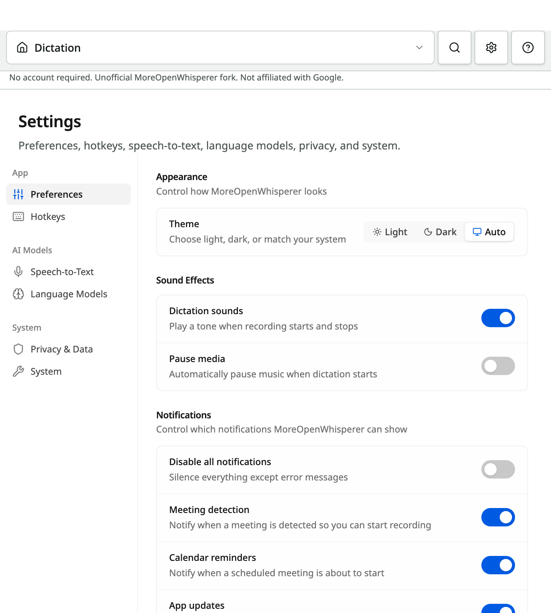

Importance: Medium importance

The control panel footer is supposed to name the upstream project. The English string is `Unofficial {{upstreamName}} fork.` and `upstreamName` is `OpenWhispr`.

`src/i18n.ts` runs `rewriteUpstreamBrand` on every translated string when this is a MoreOpenWhisperer build. That function replaces every `OpenWhispr` with `MoreOpenWhisperer`. The interpolated upstream name is replaced too. The line that shows up is `Unofficial MoreOpenWhisperer fork.`

The same three lines sit in the sidebar and in the compact nav. `ControlPanelSidebar.tsx` renders `controlPanel.shell.forkDisclosureUnofficial`.

## What the screenshot shows

Under the compact nav, the disclosure reads: No account required. Unofficial MoreOpenWhisperer fork. Not affiliated with Google.

### The first-run title wraps to three lines and the dev hint is cut off

Folder: `medium/08-first-run-title-and-clipped-hint`

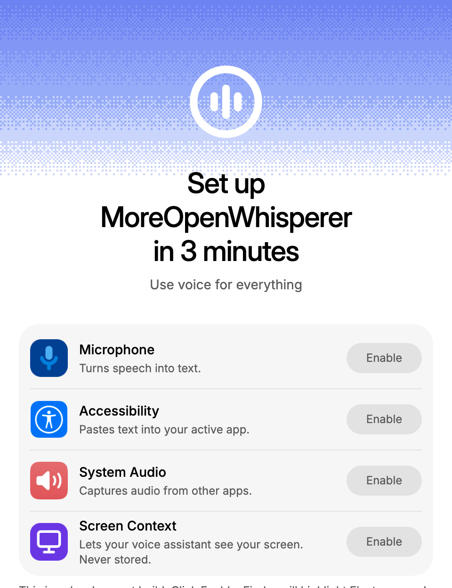

Importance: Medium importance

The permissions step is the first screen of a MoreOpenWhisperer install. The English source string is `Set up OpenWhispr in 3 minutes`. The brand rewriter turns that into `Set up MoreOpenWhisperer in 3 minutes`. The heading is capped at `max-w-72` in `CompactPermissionsStep.tsx`, and the comment above it still describes a two-line break, `Set up OpenWhispr` and `in 3 minutes`.

On a 480 by 624 content window, the heading is three lines. The h1 box runs from y 176 to y 284, which is 108px, three times the 36px line height.

The development-only hint, `onboarding.permissions.electronDevHint`, starts at y 619 and ends at y 667. The window is 624px tall, so 43px of that paragraph is past the bottom edge. `onboarding-shell-scroll` hides the scrollbar. The hint is shown only when `import.meta.env.DEV` is set, so a packaged build does not render that paragraph. The three-line title is what a packaged build still shows.

## What the screenshot shows

`clipped.png` is that 480 by 624 window. The title is three lines. The grey development hint is sliced along the bottom edge.

### Gemini 3.7 is still the default

Folder: `medium/09-gemini-3-7-is-still-the-default`

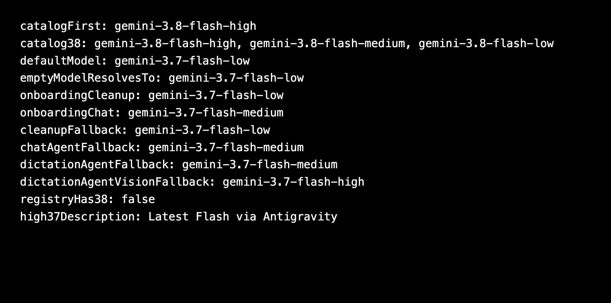

Importance: Medium importance

The current Antigravity catalog lists Gemini 3.8 Flash first. A fresh setup still starts on Gemini 3.7, and the picker has no 3.8 row.

`DEFAULT_ANTIGRAVITY_MODEL` in `src/helpers/antigravityModels.ts` and `src/helpers/antigravityModels.cjs` is `gemini-3.7-flash-low`. `resolveAgyCliModel` returns that id when the model string is empty. Onboarding in `src/components/onboarding/antigravitySetup.ts` writes `gemini-3.7-flash-low` for cleanup and `gemini-3.7-flash-medium` for chat. With no saved choice, `src/stores/settingsStore.ts` falls back to `gemini-3.7-flash-medium` for the chat agent and the dictation agent, and to `gemini-3.7-flash-high` for the vision model.

The Antigravity models in `src/models/modelRegistryData.json` stop at 3.7. There is no `gemini-3.8` id. The 3.7 high row is described as `Latest Flash via Antigravity`.

## What the run showed

`agy models` printed `gemini-3.8-flash-high` as the first row, then `gemini-3.8-flash-medium` and `gemini-3.8-flash-low`. `DEFAULT_ANTIGRAVITY_MODEL` was `gemini-3.7-flash-low`. An empty model resolved to `gemini-3.7-flash-low`. `registryHas38` was false. The 3.7 high description was `Latest Flash via Antigravity`.

## Low importance

### Antigravity model blurbs stay in English

Folder: `low/01-antigravity-descriptions-left-in-english`

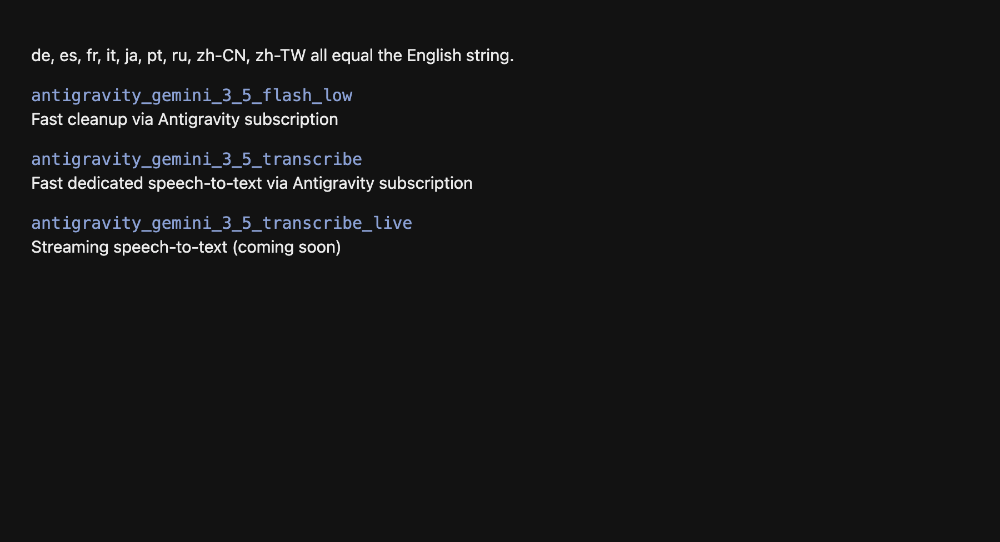

Importance: Low importance

The Antigravity rows in Settings use description keys under `models.descriptions`. In German, Spanish, French, Italian, Japanese, Portuguese, Russian, Simplified Chinese, and Traditional Chinese, these values are the same English sentences as in `src/locales/en/translation.json`:

- `models.descriptions.transcription.antigravity_gemini_3_5_transcribe`
- `models.descriptions.transcription.antigravity_gemini_3_5_transcribe_live`
- `models.descriptions.cloud.antigravity_gemini_3_5_flash_low`
- `models.descriptions.cloud.antigravity_gemini_3_5_flash_medium`
- `models.descriptions.cloud.antigravity_gemini_3_5_flash_high`
- `models.descriptions.cloud.antigravity_gemini_3_7_flash_low`
- `models.descriptions.cloud.antigravity_gemini_3_7_flash_medium`
- `models.descriptions.cloud.antigravity_gemini_3_7_flash_high`
- `models.descriptions.cloud.antigravity_gemini_3_1_pro_high`
- `models.descriptions.cloud.antigravity_claude_sonnet_4_6`
- `models.descriptions.cloud.antigravity_claude_opus_4_6`

Someone who uses the app in one of those languages still reads "Fast cleanup via Antigravity subscription" and the other English blurbs. The keys exist, so the i18n check does not report them. The strings sit on the model picker, not on the main dictation screen.

### Stale duplicate docs still name MoreOpenWhispr.app

Folder: `low/02-stale-duplicate-docs`

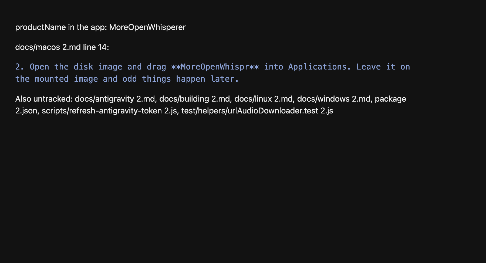

Importance: Low importance

The working tree has untracked copies with ` 2` before the extension. They still describe the shipping app as MoreOpenWhispr, including install paths such as `MoreOpenWhispr.app`. The app name in `electron-builder.json` and `src/config/mowProfile.ts` is MoreOpenWhisperer. The tracked docs under `docs/` were updated. These copies were not.

They are not imported by the build. They show up if someone opens the extra file by mistake.

Files:

- `docs/antigravity 2.md`
- `docs/building 2.md`
- `docs/linux 2.md`
- `docs/macos 2.md`
- `docs/windows 2.md`
- `package 2.json`
- `scripts/refresh-antigravity-token 2.js`
- `test/helpers/urlAudioDownloader.test 2.js`

`docs/macos 2.md` says to drag MoreOpenWhispr into Applications and to delete `/Applications/MoreOpenWhispr.app`.
