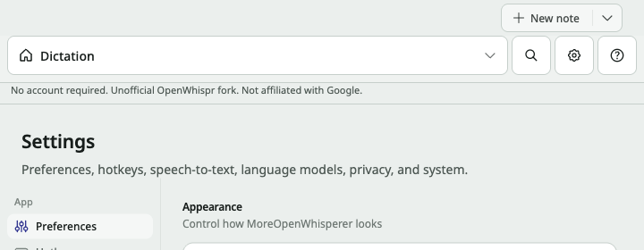
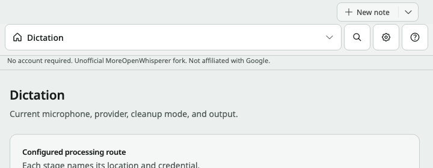
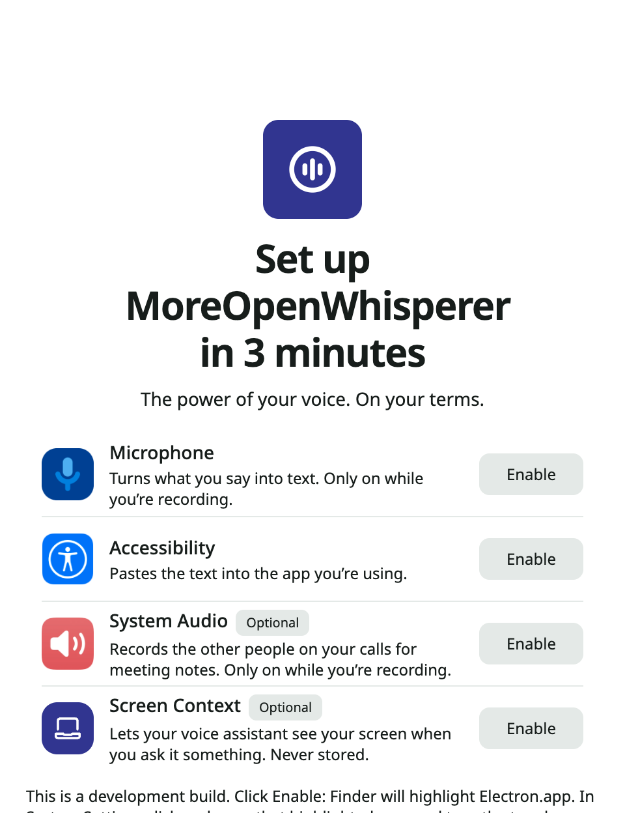
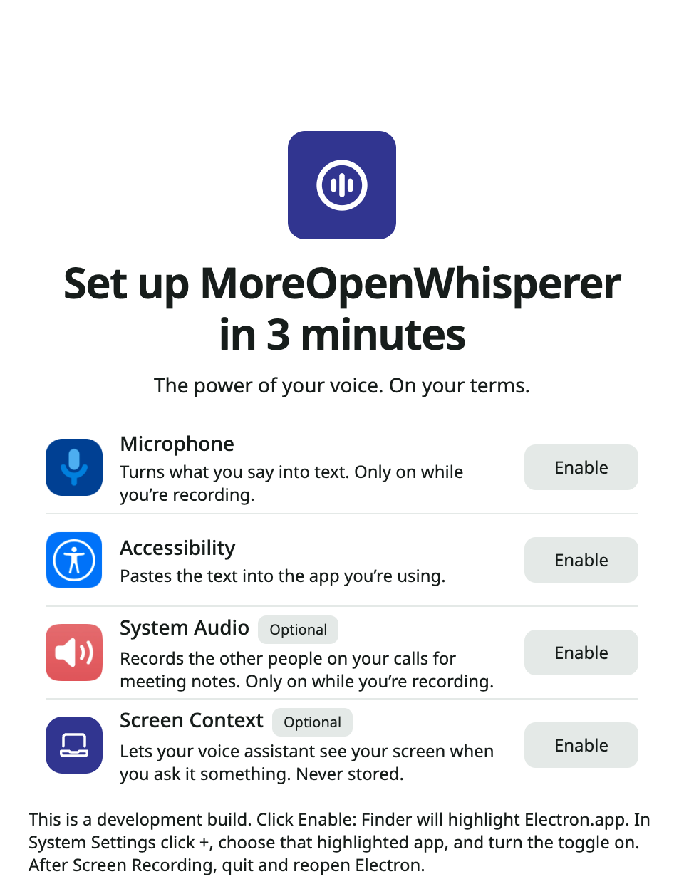

# Fixes for the rework audit

The audit ran on branch `moreopenwhispr-ui-refresh` at `266f0703`. The work since then lives on `sync/upstream-2026-09` in the `openwhispr-sync` worktree. That branch contains `266f0703` plus the upstream merge and the Gemini rewrite, so every finding was checked and fixed there.

Each finding has its own folder in `fixes/<ID>/` with:

- `notes.md`: status, root cause, fix, and files.
- `before.txt`: the new test failing on the old code, when the bug still existed.
- `after.txt`: the same test passing.
- `before.png` and `after.png`: screenshots, for the three UI findings.

## Result

| ID | Finding | Status | Commit |
|---|---|---|---|
| I01 | Assistant with tools drops the screenshot | Already fixed by the gateway rewrite, test added | 0d8ecaf1, test 2321e9c6 |
| I02 | Stopping the assistant still runs the tool | Already fixed, test added | b9ac5337, test 2321e9c6 |
| I03 | Live transcription rejects the recording | Fixed now | ddff2862 |
| I04 | Paste focuses the app and switches Spaces | Fixed now | be018d8d |
| M01 | Missing model reported as a rate limit | Already fixed, tests added | 5369b4f1, test 2321e9c6 |
| M02 | Picked transcription model not sent | Already fixed, test added | 5369b4f1, test 00e3e478 |
| M03 | Retired 3.5 Flash rows still in the picker | Fixed now | 1a29f5f3 |
| M04 | Audio conversion has no deadline | Fixed now | ddff2862 |
| M05 | Narrow window says Dictation on Settings | Fixed now | b459f484 |
| M06 | Token refresh undoes a sign-out | Already fixed and already tested | b9ac5337 |
| M07 | Fork line calls the app a fork of itself | Fixed now | 51d3d5a6 |
| M08 | First-run title on three lines, hint clipped | Fixed now | 600efe65 |
| M09 | Gemini 3.7 still the default | Fixed now, plus one follow-up | 1a29f5f3, 2acde933 |
| L01 | Antigravity blurbs left in English | Fixed now | fc6ee2fd |
| L02 | Stale duplicate docs | Fixed now (files moved to Trash) | no commit |

Whole suite after all fixes: 5551 tests, 5279 pass, 0 fail, 271 skipped (platform and upstream-only tests). `npm run typecheck` is clean. Run `npm test` to reproduce.

## Important

### I01 Assistant with tools drops the screenshot

Already fixed. The assistant no longer runs tool turns through `agy --print`. Since 0d8ecaf1 it uses the Gemini gateway with native function calling. The tool path and the no-tool path both build the first user turn with `buildInitialContents`, which attaches the screenshot as an `inlineData` image. The placeholder sentence is gone from the code.

The only path that still can't send the image is the last-resort `agy` subprocess, used when the gateway is unreachable. That is documented and tested.

Proof: a new test in `test/services/antigravityChat.test.js` runs a turn with a `create_note` tool and asserts that the image bytes are in the request and the placeholder is not. It passes.

### I02 Stopping the assistant still runs the tool

Already fixed in b9ac5337. Every chat turn now sends a request id to the main process. Abort cancels that exact request. The loop checks the signal again after every await and before each tool runs.

Proof: a new test aborts while a `create_note` call is pending, then releases the response. `executeToolCall` is never called. An existing test covers a cancel between two calls in the same turn.

### I03 Live transcription rejects the recording

Fixed now. When the live stream does not return a clean transcript, `transcribeWithAntigravity` no longer throws `AGY_LIVE_REQUIRES_PREVIEW`. It sends the recording through the normal batch path instead, with the same model choice and failover as the non-live model. The result is tagged `fellBackFromLive: true` for the logs. The audio manager already skipped the batch call only for non-empty streamed text, so it needed no change.

Proof: the test calls `transcribeWithAntigravity` with the live model and a wav buffer. Before: it threw. After: it returns text from the gateway.

### I04 Paste focuses the app and switches Spaces

Fixed now. The audit's three causes all reproduced, and each one is fixed:

1. The activation script used `activateWithOptions(3)`, which brings every window forward. It now uses `2`, which brings only the frontmost window of the target app. Activation also refuses our own process ids, meaning the main process and the Electron helpers from `app.getAppMetrics()`.
2. The target capture could store our own pid if the lookup finished after focus moved to us. A lookup that resolves to us is now dropped.
3. `app.on("activate")` showed and focused the control panel for any activation. Its decision now lives in a pure function in `dockPolicy.js`. It does nothing while our own paste activation is running, and real Dock clicks behave as before.

Proof: 7 new tests fail before the fix and pass after (31 in total across three files).

Real Space switching can't be tested automatically. Please check it once by hand:

1. Put a text editor on Space 1 and the control panel on Space 2.
2. Focus the editor and dictate with the hotkey.
3. macOS should stay on Space 1 and the text should land in the editor.

## Medium

### M01 Missing model reported as a rate limit

Already fixed. The gateway rewrite (5369b4f1, 0d8ecaf1) turns a 404 into `AGY_MODEL_UNAVAILABLE` with the real status. The renderer error mapping in `src/utils/recordingErrors.ts` checks that code before any generic rate-limit key.

Proof: new tests in `test/helpers/antigravityChatGateway.test.js` and `test/utils/recordingErrors.test.js`. A 404 never yields `providerRateLimited`.

### M02 Picked transcription model not sent

Already fixed. The hard-coded `GATEWAY_STT_MODELS` list is gone since 5369b4f1. The Antigravity settings have a speech model picker, built from the live catalog, and an explicit pick is the first candidate in the request. The two registry entries, `gemini-3.5-transcribe` and `-live`, are mode labels ("Antigravity transcription" and "with live preview"), not model names.

Proof: a new test asserts that the request body `model` equals the explicit pick.

### M03 Retired 3.5 Flash rows still in the picker

Fixed now. The three `gemini-3.5-flash-*` rows are removed from the registry. `agy models` confirms 3.5 is no longer served. The alias map stays, so a saved 3.5 choice still resolves to a model that works.

Proof: tests show no picker row is remapped to a different id and that a saved retired id still resolves.

### M04 Audio conversion has no deadline

Fixed now. The conversion was already async, but a caller without an operation budget had no deadline. It now has a 20 second default, which tests can change. Testing also found a second bug. On abort, only the direct child was killed, so a stuck grandchild process kept the pipes open. ffmpeg now runs in its own process group, and the whole group is killed.

Proof: a stand-in ffmpeg that runs `sleep 30`. Before: the call waited the full 30 s. After: it rejects within the deadline, and no process is left behind.

### M05 Narrow window says Dictation on Settings

Fixed now. The compact nav looked the active view up in the list of nav items, and Settings is not one of them. On a miss it fell back to the first item. The label now comes from `getControlPanelNavLabelKey`, which knows about Settings, and an unknown view no longer borrows another tab's name.

Before and after at 720 px wide with Settings open:

### M06 Token refresh undoes a sign-out

Already fixed in b9ac5337 and already covered by a test. Right before writing, the refresh reads the token file again. If the file is gone it writes nothing and reports signed out. If the token changed in the meantime, it keeps the newer one.

### M07 Fork line calls the app a fork of itself

Fixed now. The brand rewrite ran after interpolation, so it also renamed the `upstreamName` value. It now rewrites the translation resources once at load, before any interpolation. Plain "OpenWhispr" in normal strings still becomes MoreOpenWhisperer, and the disclosure reads "Unofficial OpenWhispr fork." All 11 locales and the prompts namespace were checked.

The main-process i18n (`i18nMain.js`) uses the same pattern, but no main-process string interpolates the upstream name, so it shows no bug. I left it unchanged.

### M08 First-run title on three lines, hint clipped

Fixed now. The heading was capped at `max-w-72`, which was sized for the shorter upstream name. Without the cap, the title is two lines in English and German at 480 by 624, and the development hint fits without clipping. The stale comment was updated too.

### M09 Gemini 3.7 still the default

Fixed now. Fresh installs and onboarding now default the cleanup, chat and dictation agent models to Automatic. Automatic picks the newest tier the live catalog serves at request time, so the default can't go stale again. The registry gains `gemini-3.8-flash-low/medium/high`, and "Latest Flash" moved to 3.8 High. The static fallback used only by the offline `agy` path is now `gemini-3.8-flash-low`.

Follow-up found in review (2acde933): with the default now "auto", that value could have reached `agy --model auto`. "auto" is now treated as no model requested, so agy uses its own default.

Proof: tests show fresh defaults do not pin 3.7, the registry has 3.8, and "auto" never becomes a `--model` flag.

## Low

### L01 Antigravity blurbs left in English

Fixed now. All Antigravity model descriptions are translated in de, es, fr, it, ja, pt, ru, zh-CN and zh-TW. Arabic had a stale "latest" claim on 3.7, which is fixed, and it gained the 3.8 rows. The keys for the removed 3.5 rows are gone from every locale.

Proof: a new locale test checks that every locale has exactly the keys the registry uses, and that no non-English value equals the English sentence. The existing translation coverage suite passes too.

### L02 Stale duplicate docs

Fixed now. The 8 files ending in ` 2` were iCloud sync copies, each an older version of a tracked file with nothing the original lacked. They were moved to `~/.Trash/openwhispr-stale-copies-2026-09-26`, so they can still be restored. Neither tree has any ` 2` files now. Moving the repo out of the iCloud-synced `~/Documents` would stop new copies from appearing.

## Verification by the user

On 2026-09-27 the user tested the dev app and the installed unsigned build and confirmed they work.
